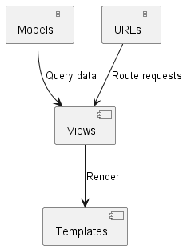

# Healthcare Appointment Scheduling System


A **full-stack web application** built with **Django REST Framework (DRF)** and **React.js** to modernize medical appointment management. Designed for **patients, doctors, and administrators**, it simplifies booking, scheduling, and tracking healthcare visits.

---

## ✨ **Features**

### **For Patients**
- ✅ User registration & secure authentication (JWT).
- ✅ Search/filter doctors by specialty, availability, or location.
- ✅ Book, reschedule, or cancel appointments.
- ✅ Receive email/SMS notifications for confirmations & reminders.

### **For Doctors**
- ⚕️ Dashboard to manage appointments & availability.
- ⚕️ View patient history and appointment details.
- ⚕️ Set working hours and leave days.

### **For Admins**
- 🔒 Manage users (patients, doctors) and roles.
- 📊 Generate reports (appointments, revenue, etc.).
- 🛠️ Oversee system settings and troubleshoot issues.

---

## 🛠️ **Tech Stack**

| **Category**       | **Technologies**                          |
|--------------------|-------------------------------------------|
| **Backend**        | Django, Django REST Framework (DRF)       |
| **Database**       | PostgreSQL                                |
| **Frontend**       | React.js, Redux (or Context API)          |
| **Auth**           | JWT (JSON Web Tokens)                     |
| **API Docs**       | Swagger/OpenAPI (`drf-yasg`)              |
| **Styling**        | CSS3, Material-UI/Tailwind (optional)     |
| **Deployment**     | Docker, AWS/Heroku                        |

---

## 🚀 **Setup & Installation**

### Prerequisites
- Python 3.9+
- Node.js 16+
- PostgreSQL 13+
- Redis (optional for caching)

### **Backend (Django)**
1. Clone the repo:
   ```sh
   git clone https://github.com/your-repo/Healthcare-appointment-scheduling-system.git
   cd backend
   ```
## Setup Instructions
1. Clone the repository:
   ```bash
   git clone https://github.com/BOSTONE069/Healthcare-appointment-scheduling-system
   ```
2. Navigate to the project directory:
   ```bash
   cd Healthcare-appointment-scheduling-system
   ```
3. Install the required packages:
   ```bash
   `pip install virtualenv`
   `myenv\Scripts\activate.bat` or `source myenv/bin/activate`
   `pip install -r requirements.txt`
   ```
4. Set up the environment variables in a `.env` file.
5. Run the migrations:
   ```bash
   python manage.py migrate
   ```
6. Start the development server:
   ```bash
   python manage.py runserver

## API Documentation
- Access the documentation through `http://127.0.0.1:8000/swagger/`

## Database Schema Diagram
- A diagram that illustrates the database schema, showing the relationships between different models.

<p style="align:center">
    
</p>

## Sequence Diagram
- A sequence diagram that outlines the interactions between different components of the system.
<p style="align:center">
    
</p>
